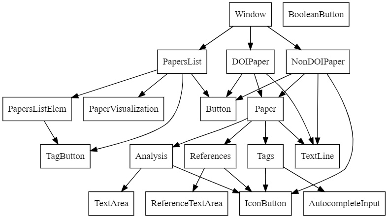

## Elements of svelte used inside this project

Relevant extract of the interactive svelte documentation for this project

- [svelte events](https://svelte.dev/tutorial/component-events)
- [svelte stores](https://svelte.dev/tutorial/writable-stores)
- [svelte bindings](https://svelte.dev/repl/c233f0db93fa4f3ba3f503fefd6faa7d?version=3.16.0) --> maybe find a better source
- [lifecycle](https://svelte.dev/tutorial/onmount)
- [slots](https://svelte.dev/tutorial/slots) & [named slots](https://svelte.dev/tutorial/named-slots)
- [conditionnaly show elements & loops](https://svelte.dev/tutorial/if-blocks)


## Guidelines (to be discussed)

### Import formats order

(every element is optional, we want to demonstrate the order if all possible types of imports are used)

1. The svelte specific imports
```ts
import { createEventDispatcher, onMount } from "svelte";
```
2. External libraries imports
```ts
import { v4 as uuidv4 } from "uuid";
```
3. Typescripts files of the project imports
```ts
import {
doiPaperStore,
paperStore,
type DOIPaper,
type TagType,
} from "../data";
import { emptyTag, insertDOIPaper } from "./libs";
```
4. Components of the project imports
```ts
import Paper from "./Paper.svelte";
import TextLine from "./TextLine.svelte";
import Button from "./Button.svelte";
```

### Organization of a svelte file

(every element except the doc and html elements is optional: here we want to demonstrate the full example with the order of the elements)

```html
<script lang="ts">
  /** My documentation general description....
   * *@param {param1}{type} description...
   * *...
   * *@fires nameSvelteEvent data provided with the event (skip if no data), event svelte fired (dispatch("nameEvent", data))
   * *...
   * *@stores nameStore access (read/write) why this store is used here (accessory: why not passed the arguments as parameters)
   */
  // 1. Imports
   import ....
   ...
    // 2. parameters 
    export let param1: type1 = valueByDefault;
    ...

    // 3. variables & event dispatcher
    let var1: type1 = valueByDefault;
    let var2: type2 = valueByDefault;
    ...

    // 4. Stores subscriptions
    myStore1.subscribe(x=>var1=x) // Example to read a store value
    ...

    // 5. functions
    function function1(param1: type1, param2: type2): type3 {
      //...
      return value;
    }
    // 6. Mount event
  onMount(() => {
    // on first creation of the component do something...
  });
</script>

<-- HTML & svelte components --!>

<style>
<-- CSS styling of the component --!>
</style>

```

## Architecture



(To modify modify and rerender the architecture.dot with graphviz online)